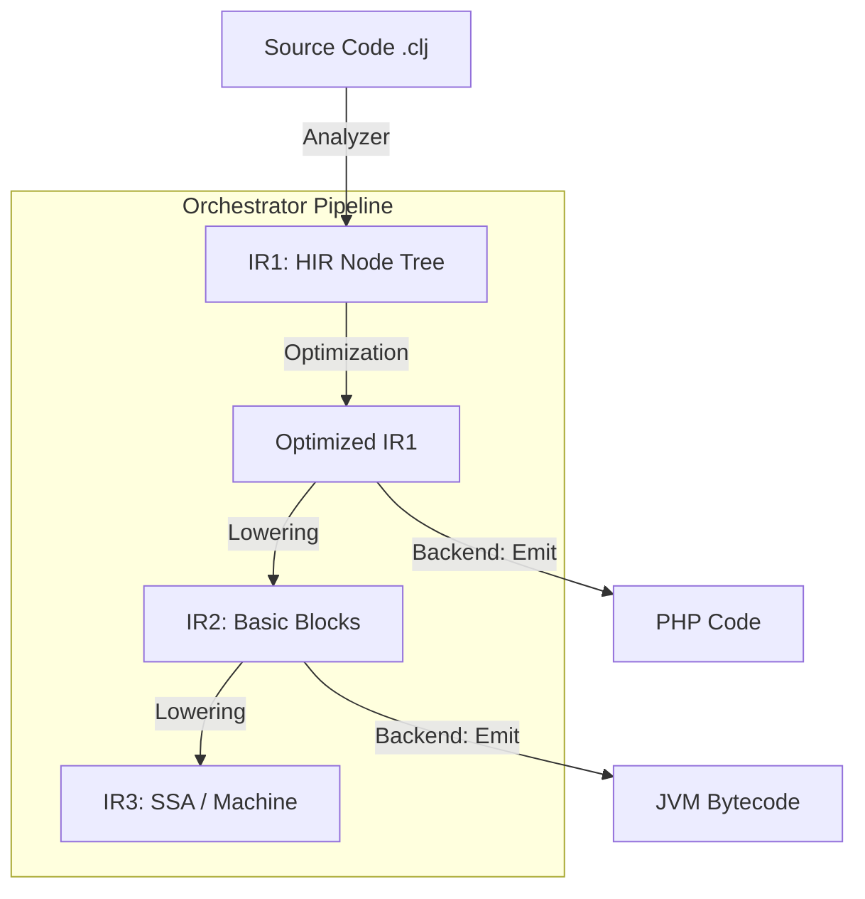
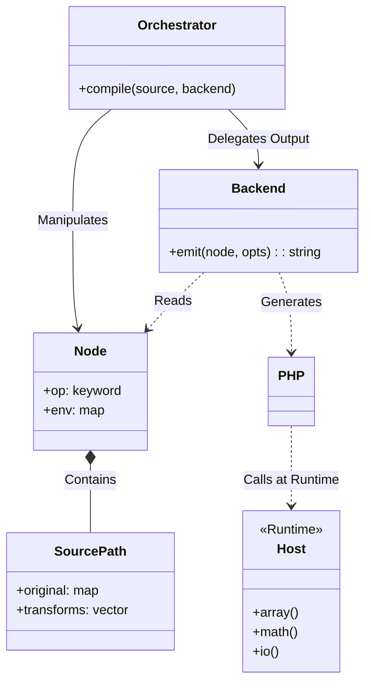

# Compiler Architecture & Relationships

This document outlines the high-level architecture of the ClojurePHP compiler, specifically focusing on the relationship between the Orchestrator, Nodes, Source Paths, and the Target Host (PHP).

## High-Level Data Flow ("The Highway")

The compiler follows a functional pipeline architecture managed by `clojure.compiler.orchestrator`.

## Key Components

### 1. Orchestrator (`clojure.compiler.orchestrator`)
The "Controller". It manages the valid transitions between IR levels and handles end-to-end delivery concerns directly, such as:
*   **Output Shape**: File, Phar, or Directory structure.
*   **Runtime Mode**: Embedding the runtime vs requiring composer.
*   **Caching**: Project-level or System-level caching.

It does **not** know about PHP specifically; it delegates to the **Backend**.

### 2. Node (`clojure.compiler.node`)
The "Data Unit". This is the High-Level Intermediate Representation (HIR).
*   **Structure**: A map `{ :op :keyword, :env {...}, :children [...] }`.
*   **Env**: Contains lexical scope and **Source Path** information.
*   **Role**: The universal language that all Backends must understand.

### 3. Source Path (`clojure.compiler.source-path`)
The "History". Unlike simple line/column tracking, Source Path tracks the *transformational history* of a node (inspired by SBCL).
*   **Original**: `{ :file "src.clj", :line 10, :col 5 }`
*   **Transforms**: `[ {:type :macro, :name "when"}, {:type :inline, :name "+"} ]`
*   **Usage**: Used by the backend to generate high-fidelity source maps and debugging information.

### 4. Backend (`clojure.php.emit-pure` / `clojure.compiler.emit`)
The "Translator". A pure function `(fn [node context] -> string)`.
*   **Input**: HIR Node.
*   **Output**: Target code string.
*   **Two Approaches**:
    *   **Pure Manual** (`clojure.php.emit-pure`): Hand-written string concatenation.
    *   **Generic Data-Driven** (`clojure.compiler.emit`): Uses a unified Syntax Map to handle C-family differences generically (O(n) buffer based).

### 5. Host (`clojure.php.host`)
The "Runtime Foundation".
*   **Implementation**: A reification of the `clojure.host/Host` protocol.
*   **Role**: Provides the "System Calls" for the Clojure runtime (Arrays, Math, IO, Regex).
*   **Runtime**: The compiled PHP code calls into this runtime (e.g., `CLJ::box(1)`) which delegates to the Host implementation.

## Integration View

